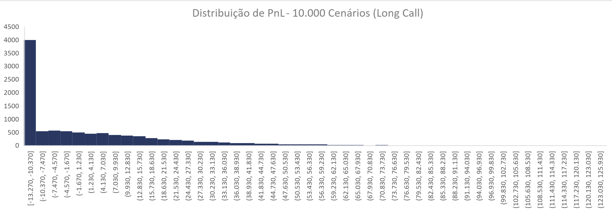

# Quant Sandbox 🚀

Um laboratório algorítmico de finanças quantitativas focado em precificação de derivativos, simulação estocástica e neutralização de risco. 

A bolsa de valores frequentemente é vista como um ambiente de pura especulação, mas as mesas institucionais operam com base em matemática estruturada. Este projeto é um motor algorítmico construído do zero em Python puro que simula milhares de futuros possíveis, mede a velocidade do caos (volatilidade) e usa estatística para calcular o preço exato que um contrato de risco deve custar hoje, eliminando a subjetividade das operações.

## 🏗️ Arquitetura Técnica

O projeto foi desenhado sob rigorosos padrões de engenharia de software, fugindo dos tradicionais "Jupyter Notebooks em bloco único" comuns na academia. 

- **Princípios SOLID:** Aplicação agressiva de Responsabilidade Única (Single Responsibility) e Inversão de Dependência (Dependency Inversion). Os motores de simulação são completamente desacoplados dos modelos matemáticos.
- **Vetorização Numérica:** Utilização de `numpy` para processamento matricial e eliminação de loops em Python, permitindo a simulação de dezenas de milhares de caminhos estocásticos em milissegundos.
- **Padrão de Injeção (Dependency Injection):** O motor de Monte Carlo atua como um *framework* genérico que aceita a injeção de qualquer processo estocástico (GBM, Heston, etc) sem necessidade de refatoração do *core*.
- **Validação Contínua (TDD)** Cobertura de testes unitários isolados na suíte tests/, garantindo que a convergência numérica do motor de Monte Carlo respeite as leis dos grandes números e valide as refatorações arquitetônicas.

## 🎯 Fases de Implementação & Roadmap

O desenvolvimento é dividido em fases de complexidade crescente, simulando a evolução da infraestrutura de uma mesa proprietária (Prop Desk).

### ✅ Fase 1: Fundações & Precificação Numérica vs Analítica (Concluída)
Construção do ambiente base, modelagem do tempo contínuo e validação de convergência numérica.
- **Modelos Determinísticos:** 
  - Títulos de Renda Fixa (Bonds)
  - Desconto de Fluxos de Caixa (DCF)
  - Câmbio a Termo (FX Forwards) e Interest Rate Swaps (IRS).
- **Modelos Estocásticos (Física de Mercado):** 
  - Movimento Browniano Geométrico (GBM) simulado via Método de Monte Carlo Vetorizado.
- **Modelos Analíticos (Gabarito Exato):** 
  - Precificador exato via fórmula fechada de **Black-Scholes-Merton**.
- **Validação:** Confronto em tempo real entre a força bruta (Monte Carlo) e a elegância analítica (Black-Scholes) para medição de erro numérico e convergência.
## 📊 Análise de Risco de Carteira (VaR e PnL)
Para além da precificação estocástica, o **Quant Sandbox** inclui uma camada de gestão de risco para simular o impacto financeiro de posições direcionais.
* **Distribuição de PnL (Profit and Loss):** Cálculo vetorizado do *payoff* e lucro/prejuízo de uma posição (ex: *Long Call*) através dos milhares de cenários gerados pelo motor estocástico.
* **Value at Risk (VaR):** Extração automatizada do VaR Histórico Simulado (nível de confiança de 99%), isolando a perda máxima esperada.
* **Integração de Dados e Automação:** Exportação via `Pandas` do array de resultados estocásticos para `.csv`, permitindo o desenvolvimento de *dashboards* em ferramentas de BI e Excel.
### 📈 Dashboard de Distribuição (Excel)
> *Distribuição de frequência do PnL baseada em 10.000 caminhos estocásticos e o limite do Value at Risk (99%).*
> 
> **Parâmetros desta simulação:** Ativo (S0) = 100 | Strike (K) = 100 | Volatilidade = 20% | Taxa Livre de Risco = 10% | Tempo = 1 ano | Posição: Compra de 1.000 Calls. 
> *Nota: O custo inicial da operação (Prêmio x Qtd) foi de R$ 13.270,00, valor que se comprova matematicamente no histograma como a barreira de perda máxima (Risco Limitado).*



### ⏳ Fase 2: Gregos, Sensibilidade e Hedge Dinâmico (Próxima)
- Cálculo das derivadas parciais do modelo (Delta, Gamma, Vega, Theta, Rho) usando o método de Diferenças Finitas.
- Simulação de rebalanceamento de carteira Delta-Neutro para operações de *Market Making*.

### 📅 Fase 3: Volatilidade Estocástica & Superfícies 
- Substituição do GBM por processos de Volatilidade Estocástica (Modelo de Heston).
- Engenharia reversa de preços da tela para extração de Volatilidade Implícita.

### 📅 Fase 4: Opções Americanas & PDEs
- Algoritmo de Longstaff-Schwartz (Mínimos Quadrados em Monte Carlo) para precificação de exercício antecipado.
- Precificação via Árvores Binomiais e Diferenças Finitas.
- Aceleração via Hardware (GPU).

## 🚀 Como Executar

O projeto possui um orquestrador via terminal interativo que permite instanciar e testar os módulos em tempo real.

1. Clone o repositório:
```bash
git clone https://github.com/JHCukier/quant_sandbox.git
```
2. Navegue até o diretório:
```bash
cd quant_sandbox
```
3. Execute o motor principal:
```bash
python main.py
```

Nota: Durante a execução da Fase 1 (Menu > Opção 2), o terminal exibirá lado a lado o preço gerado pelos 10.000 cenários de Monte Carlo contra a resolução analítica de Black-Scholes, expondo a margem de erro do motor numérico.